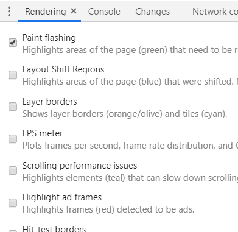

## 从输入 url 到网页呈现的过程

---

- URL 输入
- DNS 解析
- TCP 连接
- 发送 HTTP 请求
- 服务器处理并响应
- 浏览器解析渲染页面
- 连接结束

> [来源](https://juejin.im/post/5b148a2ce51d4506965908d2)

## 浏览器渲染

---

- 下载文档, 边下载边预解析需要下载的资源
- 文档下载完成(如果不是下载完成的话就没法知道闭合的标签内的元素), 解析文档, 遇到 script 标签, 如果内联执行其内容, 如果不是, 并且没有 defer, async 标签, 暂停解析, 等待下载完成后执行 script
- 如果此时还有 css 在下载, 由于浏览器安全解析策略, 会 js 和 html 都暂停等待 cssom 的构成
- 所有同步 js 执行完毕, dom 树和 cssom 树合并为渲染树, 节点开始绘制
- 如果后面又遇到了 css 标签, 重新加载 cssom 然后与 dom 合并渲染树, 所以此时会闪烁一下
- 触发 DomContentLoaded 事件

**以上是我的猜测:**

- 处理 HTML 标记构建 DOM 树, 此时 document.readyState 为 loading
- 处理 CSS 标记并构建 CSSOM 树, 等文档解析完成, readyState 变为 interactive
- 将 DOM 与 CSSOM 合并成一个渲染树(CSSOM 没加载好之前浏览器一直是白屏)
- 根据渲染树布局页面, 计算节点几何信息
- 将节点绘制
- 同步脚本都执行完成了, 触发 domContentLoaded 事件
- 等所有内容载入并且异步脚本(defer 与 async)执行完, readyState 变为 complete,浏览器触发 window 上的 load 事件
- 调用回调, 响应事件

如果 DOM 或 CSSOM 被修改, 以上过程需要重复执行

> [更快地构建 DOM: 使用预解析, async, defer 以及 preload](https://www.zcfy.cc/article/building-the-dom-faster-speculative-parsing-async-defer-and-preload-x2605-mozilla-hacks-8211-the-web-developer-blog)

> [深入浅出浏览器渲染原理 ](https://github.com/ljianshu/Blog/issues/51)

> [Inside look at modern web browser](https://developers.google.com/web/updates/2018/09/inside-browser-part1) 掘金有相关翻译, 搜索现代浏览器揭秘即可, 等不知道什么时候有空的有空再来看

### 浏览器将标签转成 DOM 的过程

- 编码, 将字节数据转为字符串
- 预解析, 找出需要下载的外部资源
- 标记化, 使用状态机, 将标签解析为语法树
- 构建树, 每解析一个标签就添加到 document 中, 对于此时不正确的构建, 如 video 拥有子元素由渲染引擎来处理

> [来源](https://segmentfault.com/a/1190000018730884)

### 浏览器解析 css 的过程

- 字符串到 Token
- tokens 到 styleRule, 一个是选择器, 一个是属性
- 生成哈希 map
- 计算 css, 设置匹配节点

> [来源](https://zhuanlan.zhihu.com/p/25380611)

### 图片加载闪烁

如果图片不固定宽高, 那么浏览器首次加载渲染时会有闪动的问题

img 标签默认是行内元素, 所以宽高取决于其本身大小, 处理方法有如下

- 采用 padding 或者 margin 来撑开
- 设定宽或高, 单独设置一个图片会自适应
- 服务器传递宽高来设置, 在瀑布流中有应用
- 使用遮罩图片

> [来源](https://www.kancloud.cn/xiak/quanduan/245428)

> [图片占位防闪烁](https://juejin.im/post/5b514e6a518825072f271173)

### defer 与 async

这两个属性会改变 js 加载的阻塞形式, 当然他们对内联脚本无效

- defer, 表示延迟执行引入的 js, 即它加载的时候 HTML 不停止解析, 当文档解析完毕且 defer 脚本也加载完毕后执行 , 然后触发 `DOMContentLoaded` 事件, 不会改变执行顺序
- async, 异步加载, 加载完就执行, 当动态添加 script 标签时, async 默认为 true, 执行顺序不一定

> [来源](https://juejin.im/entry/59e1d31f51882578c3411c77)

### html css js 的加载顺序

- 一边下载 HTML 网页, 一边开始解析
- 发现 \<script\>, 暂停解析, 将网页渲染交给 js 引擎, 但此时仍会识别脚本后面的资源, 进行预加载
- 如果 css 与 js 并行下载, 遇到 js 执行的情况, 会暂停 html 解析, js 执行, 先加载 css
- 如果引用了外部脚本就下载后执行, 否则直接执行

- 控制权还给渲染引擎

如果外部脚本时间长, 网页就会失去响应网页只会在 js 和 css 都下载完成后才开始绘制, css 和 js 并行下载, 但执行 js 需要等 css, 如果 css 放后面, dom 树构建完了, 渲染树才构建那么页面会闪跳一下, 因为此时会重新渲染页面

> [来源](https://www.cnblogs.com/yingsong/p/6170780.html)

> 这个 css 与 js 的实验不错 [JS 和 CSS 的位置对资源加载顺序的影响](https://juejin.im/entry/588036ac8fd9c50067ddbdbd)

### 所有内容的加载顺序

浏览器有五大线程, 当 js 引擎线程运行时会挂起其他线程

- GUI 渲染线程
- js 引擎线程
- 定时器线程(setTimeout)
- 事件触发线程
- http 异步请求线程(资源等)

> [来源](https://www.jianshu.com/p/e141d1543143)

## 回流重绘

---

- 回流, 当渲染树中部分元素的属性发生改变, 浏览器重新渲染的过程称为回流
  - 页面首次渲染
- 重绘, 元素样式改变不影响它在文档中的位置, 浏览器会将新样式赋予并重新绘制它

现代浏览器对回流与重绘的优化: 维护一个队列, 把所有引起回流和重绘的操作放入队列中, 如果队列中的任务数量或者时间间隔到达一个阈值, 浏览器就将队列清空, 统一一次

为了确保某些值是最精确的, 遇到部分操作会立刻清空队列:

- width, height
- getComputedStyle

### 避免方法

- CSS
  - 避免 table 布局
- JavaScript
  - 一次性重写 style 属性
  - 创建 documentFragment, 在其上面应用 dom 操作最后再添加到文档

> [来源](https://juejin.im/post/5a9923e9518825558251c96a)

### 监控回流重绘的方法

在 chrome 的 more tools 中可以打开

> [来源](https://developers.google.com/web/tools/chrome-devtools/evaluate-performance/reference#rendering)

## 浏览器一些默认操作

---

### 关闭浏览器

- 清除临时 cookie
- 清除 sessionStorage

### url 编码

当 url 中存在非英文字母, 数字和某些标点符号时就会进行编码, 一般进行 % 替换

- encodeURI, 编码完整 url, 不会编码`;/?@`等, 编码后输出 % 加上 utf-8 字符
- encodeURIComponent, 会编码上部分的内容

> [来源](http://www.ruanyifeng.com/blog/2010/02/url_encoding.html)

## 跨域请求

---

发起请求的域与该请求指向的资源所在的域不一样, 也就是`协议+域名+端口号`

通常浏览器会为了防止 csrf 攻击限制跨域请求

现在也有 `同源策略` 限制不同源的 js 对 `document`对象的读取等

### 同源策略

浏览器基本都会使用这个策略, 具体措施如下:

- DOM 层面, 限制不同源的 Document 对象或 js 脚本, 对当前对象的读取或设置属性
- cookie 和 xmlHttpRequest, 禁止 ajax 直接发起跨域, ajax 不能携带不同源的 cookie
- 但是带有 src 属性的标签例如`<script><iframe>`等可以从不同域加载
- 其他插件如 flash 也有各自的同源策略

### 请求方案

- JSONP, 百度地图

  - 非官方的跨域数据交互协议, 利用`<script>`等标签不受同源策略限制, 来实现数据跨域传输
  - 与服务器约定好一个回调函数名, 服务器接收到请求后, 将返回一段会调用之前约定好的回调函数的 js, 传入的参数便是想要的数据
  - 兼容性好, 但是只支持 GET

- CORS, github

  - cross-origin resource sharing, 是一个新的 w3c 标准, 新增一个 http 首部字段
  - Access-Control-Allow-Origin, 响应中携带这的这个首部意味着服务器允许哪些域可以访问该资源
  - cors 可以支持所有类型的 HTTP 请求

- postMessage, html5 xmr2 中的 api, 可用于跨域操作解决
  - 页面和打开的新窗口的数据传递
  - 页面和嵌套的 iframe 消息传递

> [来源](https://www.jianshu.com/p/f880878c1398)

> [九种跨域方法, 强啊](https://juejin.im/post/5c23993de51d457b8c1f4ee1)

> [mdn](https://developer.mozilla.org/zh-CN/docs/Web/HTTP/Access_control_CORS)

### 跨域方式优缺点

- jsonp
  - 能支持老浏览器
  - 只能使用 get 请求, 错误处理机制不完善
- cors
  - 能用所有 http 的请求方式

> [来源](https://www.zhihu.com/question/41992168/answer/217903179)

## 事件

---

某个特定的有意义的瞬间, 然后传递出来, 这就是观察者模式下的事件

一般用 `EventTarget.addEventListener()`, 将函数添加到调用它的 `EventTarget`的指定事件类型的事件监听器列表中

> [来源](https://developer.mozilla.org/zh-CN/docs/Web/API/EventTarget/addEventListener)

### 事件委托代理

若有很多元素需要添加事件处理, 那么将会影响页面的性能, 所以在最外层的父元素上绑定一个事件进行处理, 然后判断触发事件的元素上的属性来判断如何执行, 如果要获取触发事件元素的父元素可以利用 `parentNode` 递归查找

当然也有不适合使用事件委托的事件, 比如说 `mousemove, mouseover` 等

> [来源](https://www.cnblogs.com/liugang-vip/p/5616484.html)

### 事件冒泡捕获

事件流描述的是从页面接收事件的顺序, IE 是事件冒泡, 网景是事件捕获

- 冒泡, 从触发事件的元素逐渐向上传播直到 window
- 捕获, 从 window 到触发事件的元素, 老版本浏览器不支持, 所以一般用冒泡

DOM2 级规定事件流, 有捕获阶段, 处于目标阶段, 和事件冒泡阶段

> [来源](https://segmentfault.com/a/1190000012729080)

### 如何阻止事件冒泡与取消默认事件

- 阻止事件冒泡
  - `e.stropPropagation()`
- 取消默认事件
  - `e.preventDefault()`
  - `return false`

> [来源](http://caibaojian.com/javascript-stoppropagation-preventdefault.html)

## DOM 事件模型级数

---

the document obect model, 作为规范定义了 html 的操作的编程接口

- 0 级, 点击这个节点, 节点就执行 handler
- 1 级, 规范化之前的做法
- 2 级, 除了目标节点, 允许目标的祖先节点也有机会处理, 只有用`addeventlistener`才能

> [来源](https://www.jianshu.com/p/75183574ada7)

## 浏览器缓存

---

重复利用文件, 提升性能

### 缓存位置

- Service Worker, 运行在浏览器背后的独立线程, 使用的传输协议为 HTTPS, 它与其他内置的缓存机制不同, 可以自由控制缓存
  - 注册, 监听 install 事件
  - 用户访问时可以通过拦截请求的方式查询是否存在缓存
  - 如果没有命中缓存, 需要调用 fetch 来获取数据, 无论是从缓存中获取还是网络请求获取, 从 network 面板中看都会是从 service worker 中获取的内容
- memory cache, 包含的是当前页面中已有的资源, 如样式, 脚本, 图片, 一旦关闭标签页内存中的缓存也就被释放了, 刷新当前标签页会有
  - 若内存中有缓存就不会关心返回资源的 HTTP 头部字段 cache-control
- disk cache, 硬盘中的缓存, 大文件一般在硬盘, 内存使用率高时也优先存入硬盘, 第一次打开新标签有缓存
- push cache, http2 的内容, 当上面的都没有命中时会使用

### 强缓存与协商缓存

- 强缓存, 不关心资源是否更新, 通过两个头部字段实现
  - Expires, 指定资源到期的时间, 等于`max-age+请求时间`, 作为 http1 的产物, 如果修改本地时间缓存失败
  - cache-control, 在 http1.1 中用于控制网页缓存, 有多种指令可以控制从代理到客户端的缓存
  - 两者同时存在优先 cache-control
- 协商缓存, 在强制缓存失效后, 浏览器携带缓存标识请求服务器, 缓存标识生效, 返回 304 Not Modified, 失效, 返回 200 和请求结果, 通过两种头部字段实现
  - last-modified, 第一次访问时会在响应中添加, 浏览器下一次请求该资源时, 检测到之前缓存的请求有这个 header, 就会添加 if-modified-since 字段, 值和 last-modified 一致, 如果服务器中该资源的最后修改时间没有变化, 返回 304, 大于的话就返回 200 和新的资源, 为了判断文件是否真的被修改, 在 http1.1 中出现了 ETag
  - ETag, 返回当前资源文件的唯一标识, 只要资源有变化, 就会重新生成 Etag, 浏览器下次请求资源时, 会将之前的 Etag 的值放在 If-None-Match 字段中, 发往服务器比较
  - 如果文件一秒内变了多次或者仅仅是打开查看了, 那么用 last-modified 就和期望行为不一致 , 而且如果采用了负载均衡, 不同服务器生成的 last-modified 也有可能不一致
- 如果强制缓存生效直接缓存, 否则协商缓存, 如果服务器什么缓存也没设置, 浏览器可能会用响应头的 Date 减 last-modified 值的 10% 来作为缓存时间

### ajax 取消缓存

- setRequestHeader("If-Modified-Since","0")
- setRequestHeader("Cache-Control","no-cache")
- 加个随机数, 浏览器认为 url 改变了就重新请求了

> [来源](https://www.jianshu.com/p/54cc04190252)

> [缓存的最佳实践](https://juejin.im/post/5c136bd16fb9a049d37efc47)

## webstorage

---

- cookie
- localstorage, sessionstorage
- websql, sqlite3
- indexdb

> [来源](https://juejin.im/post/593d0c5d61ff4b006c8fec76)
