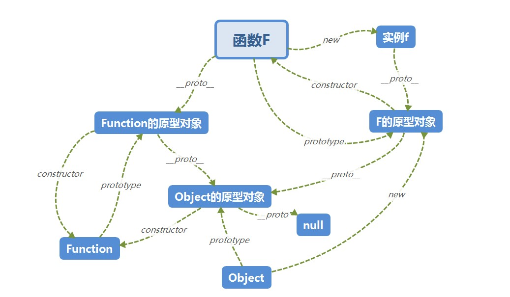
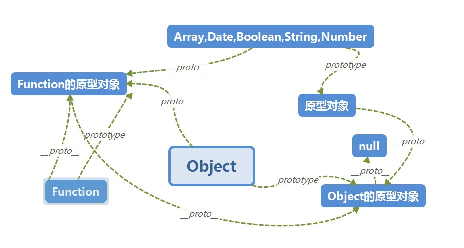

## typeof

最初的实现中 js 中的值是由一个标识类类型的标签和实际数据表示的, 对象的类型标签为 0, 由于 null 代表空指针, 所以也是 0, typeof null 也因此返回 object, **若是想要清晰的判断**可以使用 `Object.prototype.toString`

对于现在的 typeof, 如果对象实现\[\[call]]的内部方法就认为是 function

> [来源](https://juejin.im/post/5df3d255f265da33f030237e)

## instanceof

用来判断对象的具体类型, 通过循环对比原型链判断知道左边的变量的原型为 null, 然后由此有了原型继承

> [来源](https://juejin.im/post/5b0b9b9051882515773ae714)

```javascript
function new_instance_of(leftVaule, rightVaule) {
  let rightProto = rightVaule.prototype; // 取右表达式的 prototype 值
  leftVaule = leftVaule.__proto__; // 取左表达式的__proto__值
  while (true) {
    if (leftVaule === null) {
      return false;
    }
    if (leftVaule === rightProto) {
      return true;
    }
    leftVaule = leftVaule.__proto__;
  }
}
```

## 原型

### prototype 和 \_\_proto\_\_

对象有 \_\_proto\_\_ 属性, 构造函数另外还有 prototype, 对象的 \_\_proto\_\_ 等于其构造函数的 prototype, 构造函数的 prototype 的 constructor 属性要等于其自身



### 原型中的继承

当在实例中找不到方法或属性时会沿着\_\_proto\_\_找, 也就是构造函数的原型对象中去寻找, 直到 object.prototype.\_\_proto\_\_

### 六大内置函数的继承

可以看到所有的构造函数的 \_\_proto\_\_ 都指向了 Function 的原型对象, 所有原型对象的 \_\_proto\_\_ 都指向了 Object 的原型对象



## 数据类型

`Boolean, undefined, string, number, null, bigint, symbol, object`

除了 object 前 7 种是基本类型, 既无对象也无方法

### 基本类型的包装对象

`String, Number, BigInt, Boolean, Symbol(字面量基本类型)`, 包装对象的 valueof 方法返回基本类型的值

## this

| 场景 | 指向的对象 |
| --- | --- |
| 普通调用函数 | 非严格 window,严格 undefined |
| 对象调用 | 调用函数的对象 |
| call,apply,bind | 参数中的第一个值, 非严格模式下指定 undefined, null 为 window,指定基本值会转为其包装对象 |
| 构造函数调用 | 指向生成的新对象 |
| 原型链调用 | 指向生成的对象 |
| 箭头函数 | 没有自己的 this, 找上一个作用域的 |
| dom 事件处理函数 | 一般是绑定事件的元素, 古老 ie 指向 widnow |  |

## 作用域

## 闭包

## 对象

## 运算符优先级

https://developer.mozilla.org/zh-CN/docs/Web/JavaScript/Reference/Operators/Operator_Precedence

## 内部属性
