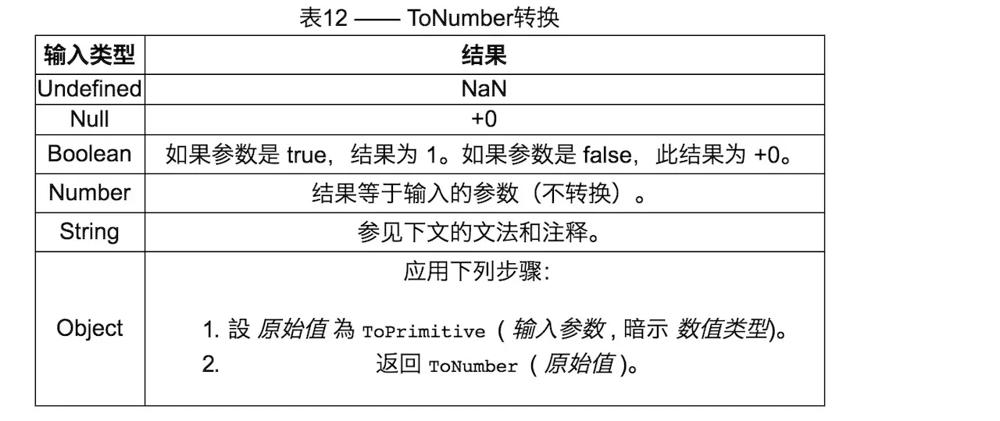
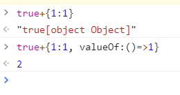

## 判断对象类型

---

### typeof

最初的实现中 js 中的值是由一个标识类类型的标签和实际数据表示的, 对象的类型标签为 0, 由于 null 代表空指针, 所以也是 0, typeof null 也因此返回 object, **若是想要清晰的判断**可以使用 `Object.prototype.toString`

对于现在的 typeof, 如果对象实现\[\[call]]的内部方法就认为是 function

> [来源](https://juejin.im/post/5df3d255f265da33f030237e)

### Object.prototype.toString()

首先取得对象的一个内部属性`[[class]]`, 根据该属性返回一个类似于`[object xxx]`的字符串, 因为如果直接`o.toString()`很有可能这个对象的方法被更改过, 所以用`call`来改变 this 指向更稳妥

`Object.toString()`, 继承自 `Function.prototype.toString()`

### instanceof

用来判断对象的具体类型, 通过循环对比原型链判断知道左边的变量的原型为 null, 然后由此有了原型继承

> [来源](https://juejin.im/post/5b0b9b9051882515773ae714)

```javascript
function new_instance_of(leftVaule, rightVaule) {
  let rightProto = rightVaule.prototype; // 取右表达式的 prototype 值
  leftVaule = leftVaule.__proto__; // 取左表达式的__proto__值
  while (true) {
    if (leftVaule === null) {
      return false;
    }
    if (leftVaule === rightProto) {
      return true;
    }
    leftVaule = leftVaule.__proto__;
  }
}
```

> [javascript 判断变量是否是数组（Array）](https://segmentfault.com/a/1190000004479306) instanceof 的缺点是没法处理不同 iframe 的判断

## 原型

---

### prototype 和 \_\_proto\_\_

对象有 \_\_proto\_\_ 属性, 构造函数另外还有 prototype, 对象的 \_\_proto\_\_ 等于其构造函数的 prototype, 构造函数的 prototype 的 constructor 属性要等于其自身


### 原型中的继承

当在实例中找不到方法或属性时会沿着\_\_proto\_\_找, 也就是构造函数的原型对象中去寻找, 直到 object.prototype.\_\_proto\_\_

### 六大内置函数的继承

可以看到所有的构造函数的 \_\_proto\_\_ 都指向了 Function 的原型对象, 所有原型对象的 \_\_proto\_\_ 都指向了 Object 的原型对象

`Function.prototype` 是个函数, 但是继承自 `Object.prototype` 而非自身


### 主要继承方法

- 原型继承, 将子类的原型指向了父类的实例, 这样子类就可以通过`__proto__`摸到父类的实例属性, 再由父类的实例的`__proto__`摸到其构造函数的原型对象

```javascript
function p() {
  this.x = 1;
}
function c() {}
c.prototype = new p();
```

- `call`继承, 这样父类改变了子类的实例, 不过`call`是`Function`上的方法

```javascript
function p() {
  this.x = 1;
}
function c() {
  p.call(this);
}
```

- 冒充对象继承, 循环遍历父类实例, 然后将父类实例的私有方法全部拿来给子类实例

```javascript
function p() {
  this.x = 1;
}
function c() {
  let p1 = new p();
  for (let i in p1) {
    this[i] = p1[i];
  }
}
```

- 混合继承, 将 `call` 继承和原型继承集合在一起

```javascript
function p() {
  this.x = 1;
}
function c() {
  p.call(this);
}
c.prototype = new p();
c.prototype.constructor = c;
```

- 中间件继承, 子类可以继承到父类的公有方法当做自己的公有方法

```javascript
function p() {
  this.x = 1;
}
function c() {}
c.prototype.__proto__ = p.prototype;
```

- 寄生组合继承

```javascript
function p() {
  this.x = 1;
}
function c() {
  p.call(this); //继承实例属性
}
function inheritPrototype(sub, sup) {
  var prototype = Object.create(sup.prototype); //继承原型链
  prototype.constructor = sub;
  sub.prototype = prototype;
}
inheritPrototype(c, p);
```

- 经典继承

```javascript
function create(o) {
  function c() {}
  c.prototype = o;
  return new c();
}
var o = {};
var c1 = create(o); //这样就继承o了
```

> [来源](https://juejin.im/post/5a96d78ef265da4e9311b4d8)

### 继承方法比较

- 原型继承, 不同子类实例会共享同一对象, 如果修改属性其他实例获得的也是修改的, 并且创建子类实例的时候不能向超类构造函数传递参数
- 组合继承, 每次都会调用两次超类的构造函数, 并且不同子类实例共享同一对象

完美的是寄生继承, 子类都有各自的实例, 不会互相影响, 且共享了父类的方法

> [来源](https://juejin.im/post/5bbca0c6f265da0aa35946b3)

### 公有属性与私有属性

定义在构造函数内的`this.x`就是私有的, 定义在原型对象上的是公有的

## 数据类型

---

`Boolean, undefined, string, number, null, bigint, symbol, object`

除了 object 前 7 种是基本类型, 既无对象也无方法

### 基本类型的包装对象

`String, Number, BigInt, Boolean, Symbol(字面量基本类型)`, 包装对象的 valueof 方法返回基本类型的值

## 执行上下文

---

可执行代码共有三种, 全局, 函数, eval, 每当执行其中一种时, 就会创建一个执行上下文

为了保存上下文, 用一个栈来保存, 当执行完毕时就会将函数的执行上下文从栈中弹出

创建过程会完成: `变量对象创建, 作用域链建立, this 的指向`

> [来源](https://github.com/mqyqingfeng/Blog/issues/4)

### 变量对象

当进入执行上下文时, 激活变量对象, 初始化内容包括: 函数的所有形参, 函数声明, 变量声明, 在代码执行过程中修改变量的值, 全局上下文的变量对象在浏览器中是 window

> [来源](https://github.com/mqyqingfeng/Blog/issues/5)

### 变量提升

编译时, 将 var 声明的变量和函数放入内存, 提升到前面, 函数比变量提升的更靠前, 但是这个提升不会初始化, 提前使用变量不会报错, 但值会是 undefined

> [来源](https://developer.mozilla.org/zh-CN/docs/Glossary/Hoisting) > [详细解释过程](https://github.com/mqyqingfeng/Blog/issues/5#issuecomment-305073897)

> [题目](https://segmentfault.com/q/1010000002886791)

## 作用域

---

作用域 scope 包含当前可见的变量, 规范了如何查找变量, 内层作用域可以访问外层作用域

| 范围 | 含义                                                                                   |
| ---- | -------------------------------------------------------------------------------------- |
| 全局 | 能被程序中任何函数或方法访问                                                           |
| 函数 | 函数内的作用域, 外部无法访问, 内部能访问                                               |
| 块级 | 使用 let 声明 for 循环, 循环结束后声明的变量就释放了, 只要是`{}`包裹的就行             |
| eval | 相当于程序运行前这里写了代码, 严格模式下运行在自己的作用域下, 不会修改包含自己的作用域 |
| 词法 | 使用变量时, 由声明的位置决定,**何处声明**                                              |
| 动态 | 作用域由调用栈的层次决定寻找路径, **何处调用**                                         |

### 作用域链

当查找变量时, 如果当前上下问的变量对象 `VO` 没有, 就会到父级的变量对象中查找, 一直到全局变量, 这样由多个变量对象组成的链表就叫做作用域链, **注意** 应该是创建这个函数的作用域, 不是调用, [可以看看这里](https://juejin.im/post/5c8290455188257e5d0ec64f#heading-8), 这就是静态即词法作用域

函数有内部属性 `[[scope]]`, 当函数创建时会保存所有父变量对象, 函数激活时, 进入函数上下文,创建 VO 后将其添加到作用链的前端

> [来源](https://github.com/mqyqingfeng/Blog/issues/6)

### 闭包

即使创建该函数的上下文已经销毁却仍然存在（比如，内部函数从父函数中返回）, 并在代码中引用了自由变量的函数便是闭包

虽然创建的上下文销毁, 但是依靠作用域链仍然能够读取到自由变量

> [来源](https://github.com/mqyqingfeng/Blog/issues/9)

#### 闭包与逃逸分析

从当前函数外部课访问某个对象, 即该对象逃逸了

> [来源](https://segmentfault.com/a/1190000011413430)

### 立即执行函数

利用运算符的优先级, 将相邻的 js 语句运算, 运算的同时也就执行定义的匿名函数

不暴露私有成员

## this

---

当函数被调用时, 一个执行环境被创建, 环境中包括: 调用栈, 如何调用, 参数等, this 指向这样的变量对象

绑定规则有:

- 默认, 独立调用
- 隐式, 对象调用
  - 隐式丢失, 然后就变成 window
    - 函数别名
    - 参数传递, setTimeout 就是
    - 间接引用

```JavaScript
(obj.f = obj.f)();//都相当于立即执行表达式, 将函数赋值后立刻执行
(false || obj.f)();
(1, obj.f)();
```

- 显式, call,apply,bind
- new, 构造函数

| 场景             | 指向的对象                                                                              |
| ---------------- | --------------------------------------------------------------------------------------- |
| 普通调用函数     | 非严格 window,严格 undefined                                                            |  | 对象调用 | 调用函数的对象 |
| call,apply,bind  | 参数中的第一个值, 非严格模式下指定 undefined, null 为 window,指定基本值会转为其包装对象 |
| 构造函数调用     | 指向生成的新对象                                                                        |
| 原型链调用       | 指向生成的对象                                                                          |
| 箭头函数         | 没有自己的 this, 找上一个作用域的                                                       |
| dom 事件处理函数 | 一般是绑定事件的元素, 古老 ie 指向 widnow                                               |
| setTimeout       | 一般指向全局对象                                                                        |

> [来源](https://alexzhong22c.github.io/2017/08/07/js-this/) > [有机会认真看看](https://github.com/mqyqingfeng/Blog/issues/7)

下面就是认真看的~~

### 类型

- 语言类型, 可以直接操作的, 就是基本类型
- 规范类型, 算法描述语言结构的, 包括:
  - Reference
  - List
  - Lexical Environment
  - Environment Record, 现在也可以代替 es3 常说的变量对象 VO

有关 this 要重点说一下 Reference, 用来解释 delete, typeof 和赋值等行为的

由三个部分组成:

- base value, 属性所在的对象或 Environment Record
- referenced name, 属性名字
- strict reference

另外还有几个方法,参数为 Reference 类型:

- `GetBase()`, 返回 reference 的 base value
- `IsPropertyReference()`, 如果 base value 是对象就返回 true
- `GetValue()`, 返回具体的值

下面是确定 this 的取值的过程:

- 计算 MemberExpression , 也就是`xxx.xxx()`中的`xxx.xxx`, 给 ref, 测试 ref
- ref 是 Reference, 且 `IsPropertyReference()`为真, this 为 `GetBase()`
- 若 base value 是 Environment Record 那么 this 值为`ImplicitThisValue()`, 也就是始终返回 undefined
- 不是 Reference, this 为 undefined

## js 内存回收

---

在定义时便完成了内存分配

- 垃圾回收, 使用引用的方式
  - 引用计数垃圾收集, 会有循环引用内存泄露的问题
  - 标记清除算法, 将对象定义为是否可以获得

> [来源](https://developer.mozilla.org/zh-CN/docs/Web/JavaScript/Memory_Management)

## js 在 v8 中的执行流程

语言的解析基本都差不多

- 源代码 token 化
- 转为语法树
- 生成字节码并执行

> [来源](https://juejin.im/post/5df1ed1f6fb9a015fd69b78d)

## js 执行过程

---

- 语法分析
- 预编译阶段
- 执行阶段

### 语法分析

加载代码完毕后, 此时分析语法是否正确, 比如 await 需要在 async 函数中

### 预编译与执行

- 进入全局环境, 预编译创建全局执行上下文, 推入事件循环所说的执行栈中, 进入执行阶段
- 调用函数, 预编译创建函数执行上下文, 推入栈中, 进入执行阶段
- 在函数内调用函数, 重复上一步操作
- 若没有继续调用其他函数开始执行然后出栈
- 全局执行上下文在标签页关闭时出栈

**创建执行上下文的过程**

- **变量对象**, 全局环境, window 就是变量对象
  - 创建 arguments 对象, 仅在非箭头的函数环境
  - 检查函数声明, 若没有与函数名相同的变量名则创建一个指向该函数地址的引用, 如果有就用该函数引用覆盖,arguments 的也会覆盖
  - 检查变量声明, 如果没有就在变量对象以此变量名创建一个属性, 值为 undefined, 如果有就忽略这个变量声明

```JavaScript
function test(tem){
  tem()
  console.log(arguments) //在这里断点可以看到arguments[0]变成了函数引用
  var tem = 1// 执行完这里 arguments[0] 又变成了 1, 可以看到 arguments[0] 和 变量对象中 tem 的值是同步的
  function tem(){
    console.log(tem)
  }
  console.log(tem)
  return tem;
}
test(2)
```

> 进入执行阶段后, 变量对象 VO 变为 活动对象 AO

- 建立作用域链, 由当前变量对象和上层的一系列活动对象组成, 这些作用域是词法作用域, 由所处的位置决定

```JavaScript
function a(){
  var d = 1;
  function b(){
    console.log(d)//从chrome中可以看到这里的d是closure闭包
    c()
  }
  b()
}
function c(){
  console.log(d)//无法访问到会报错, 如果放在b函数内就能得到一个d的闭包
}
a()
```

- this 指向, 参考前面

> [来源](https://heyingye.github.io/2018/03/19/js%E5%BC%95%E6%93%8E%E7%9A%84%E6%89%A7%E8%A1%8C%E8%BF%87%E7%A8%8B%EF%BC%88%E4%B8%80%EF%BC%89/)

### 执行阶段

之前浏览器那章也讲了相关线程, 这里说一下参与 js 执行的线程

- js 引擎
- 事件触发
- 定时器触发
- HTTP 异步请求

先有几个概念:

- 宏任务
  - 同步任务
  ```JavaScript
  console.log(123)
  ```
  - 异步任务, 不直接进入 js 主线程, 等触发后, 相关线程将该任务推进任务队列, 等待主线程空闲时读取执行, 例如 Ajax, DOM, SetTimeout
  ```JavaScript
  setTimeout((res)=>{
  console.log(123)
  },0)
  ```
- 微任务, es6 和 node 环境中新出现的, 在同步任务执行完成后看是否有可执行的微任务, 然后再看任务队列, 主要有 promise, process.nextTick

```JavaScript
new Promise((res)=>{
  console.log(123)
})
```

在执行阶段, 代码的执行顺序为: `宏任务(同步) -> 微任务 -> 宏任务(异步`

> [来源](https://heyingye.github.io/2018/03/26/js%E5%BC%95%E6%93%8E%E7%9A%84%E6%89%A7%E8%A1%8C%E8%BF%87%E7%A8%8B%EF%BC%88%E4%BA%8C%EF%BC%89/) 这作者还行

## 参数传递

---

基本类型传的是本身, 对象传的是引用, 如果函数内有相同名称的参数, 在此参数赋值之前不会改变传入的参数的内容

```JavaScript
function test(tem){
  console.log(tem) // 2
  console.log(arguments)
  var tem = 1
  console.log(tem) //1
  return tem;
}
test(2)
```

> [来源](https://juejin.im/entry/59b41b005188257e671b671c)

### 形参实参

- 形参: 定义时的参数
- 实参: 运行时传入的参数

## 事件循环

---

函数调用形成栈, 队列内的消息等待栈执行完毕后进入栈中

只有函数完整的执行后, 其他函数才会被执行, 这与 java 什么的不一样, 不需要内存同步, 信号量加锁等操作

可以在队列中添加消息的情况

- 事件监听
- setTimeout, 参数代表的延迟的最短时间, 如果队列有其他消息, settimeout 必须等待其执行完

web worker 或者跨域的 iframe 都有自己的栈, 要通信需要 `postMessage`

因为这个特性, js 一般不会阻塞, 可以用来接收多个请求然后等待回调返回, 但是 alert 和 xhr 请求同步会阻塞

> [来源](https://developer.mozilla.org/zh-CN/docs/Web/JavaScript/EventLoop)

> [详解 JavaScript 中的 Event Loop（事件循环）机制](https://zhuanlan.zhihu.com/p/33058983)

### 事件循环与浏览器渲染

> [来源](https://juejin.im/entry/596d78ee6fb9a06bb752475c)

#### requestAnimationFrame 的发生顺序

### node 与浏览器的区别

node 的表现与浏览器差不多, 但是它依靠 v8 来解释 js, 用 libuv 引擎来实际执行

node 中事件循环的顺序, 执行完下面六个阶段算一个 tick, [首先检查 process.nextTick](https://zhuanlan.zhihu.com/p/37714012), 然后检查微服务队列里的 promise, 然后是下面的

- timer, 检查定时器队列, 如 setTimeout
- IO callback, 执行系统调用错误, 比如网络通信错误
- idle, prepare, 仅在 node 内部使用
- poll, 获取新的 IO 事件, 适当条件 node 将阻塞于此
- check, 执行 setImmediate 的回调
- close callbacks, 执行 socket 的 close 事件回调

> [来源](http://lynnelv.github.io/js-event-loop-nodejs)

> [面试题：说说事件循环机制(满分答案来了)](https://www.zhihu.com/question/268004898/answer/434687563)

## 运算符

---

- [&& 逻辑与](https://www.jianshu.com/p/07a1cabe6484), 当第一个转为布尔值是 false 返回第一个值, 为 true 返回第二个值

### 优先级

https://developer.mozilla.org/zh-CN/docs/Web/JavaScript/Reference/Operators/Operator_Precedence

## 内部属性

---

内部属性定义了代码执行的行为, 但是没法通过代码直接访问, 一般用`[[]]`包了起来, 当然有要使用`[[prototype]]`的时候, 就可以用`Object.getPrototype()`来访问

### 数据属性

若是想要修改属性的特性, 用`Object.definePrototy()`

| 名称             | 含义                                    |
| ---------------- | --------------------------------------- |
| [[configurable]] | 这个属性能否 delete, 能否修改属性的特性 |
| [[enumerable]]   | 能否通过 for-in 返回                    |
| [[writable]]     | 能否修改属性的值                        |
| [[value]]        | 包含这个属性的数据值, 默认为 undefined  |

### 可枚举性和所有权

> [来源](https://developer.mozilla.org/zh-CN/docs/Web/JavaScript/Enumerability_and_ownership_of_properties)

### 访问器属性

访问器属性也需要通过`Object.definePrototy()`来定义

| 名称             | 含义                                    |
| ---------------- | --------------------------------------- |
| [[get]]          | 读取属性时调用的函数                    |
| [[set]]          | 写入属性时调用的函数                    |
| [[configurable]] | 这个属性能否 delete, 能否修改属性的特性 |
| [[enumerable]]   | 能否通过 for-in 返回                    |

> 若要读取对象中这些属性的描述, 可以通过`Object.getOwnPropertyDescriptor()`

### chrome 中可见的

| 名称                 | 含义                                    |
| -------------------- | --------------------------------------- |
| [[scope]]            | 作用域链                                |
| [[FunctionLocation]] | 函数的位置                              |
| [[prototype]]        | \_\_proto\_\_, 指向构造函数的 prototype |
| [[constructor]]      | 构造函数                                |
| [[call]]             | 调用函数                                |

> [内部属性相关规范](http://es5.github.io/#x8.6.2)

### 函数里有的

| 名称     | 含义                                                                                                                       |
| -------- | -------------------------------------------------------------------------------------------------------------------------- |
| [[Call]] | 执行与此对象关联的代码。通过函数调用表达式调用。内部方法的参数是一个 this 值和一个包含通过调用表达式传递给函数的参数的列表 |

## 类数组

---

指可以通过索引属性访问元素并且拥有 length 属性的对象, 类数组对象与数组的区别是类数组对象不能直接使用数组的方法。

## 类型转换

---

### valueOf() 与 toString()

这两个方法可以在 `Object.prototype`上看到, 每个原型对象又都继承它, 通常会被改写, `Function.prototype`上便有覆盖的 `toString()` 函数, 因此所有构造函数由于继承了 `Function.prototype` 所以 `toString()` 都被改写了

```JavaScript
function F(){}
Object.prototype.toString.call(F)//[Object Function]
F.toString()//function F(){}
```

- toString(), 返回对象的字符串表示
- valueOf(), 返回对象的字符串, 数值或布尔值表示, 一般情况下优先调用, 如一元操作符

### 转换规则

- 布尔
  - false、undefinded、null、0、'' 为 false
  - true、1、'somestring'、[Object] 为 true
- ToNumber

  - string 转换相当于调用 `Number()`

  

- ToString


- ToPrimitive

将对象转为非对象的基本值

```javascript
/**
 * @obj 需要转换的对象
 * @type 期望转换为的原始数据类型，可选
 */
ToPrimitive(obj, type);
```

type 可以是 number 或者 string

- string
  - 调用 obj 的 `toString` 方法, 如果为基本值返回
  - 调用 obj 的 `valueOf` 方法
- number
  - `valueOf`
  - `toString`
- 参数为空
  - obj 是 Date, type 设置为 String
  - 否则设置为 Number

### 运算隐式转换

- `+`运算

  - 对象进行 `ToPrimitive` 操作, 参数为空
  - 若是存在 string 都转换为 string 进行拼接
  - 若是对象进行 `ToPrimitive` 操作没 string, 两边做 ToNumber 处理

  

- `==` 抽象相等比较

  - 存在对象执行 `ToPrimitive`
  - 类型不同, 将其转为 number 来比较
  - null 与 undefined 相比为 true, 其他与之相比为 false
    - undefined 或 null 时，不作强制类型转换, 但是小于等于的操作符会把它转为 number, 所以会有下面的奇葩 
  - 布尔类型转为数字 `true == '2'是false`
    - true 转为 1, '2'变为 2

- 一元运算符, 只有一个参数的操作符

  - `+`, 尝试将操作数转为数字
  - `!`, 布尔操作符, 将操作的值强制转换为布尔值并且取反

    - 双感叹号用来取布尔值, 负负得正, 不改变原值的布尔判断

  > [来源](https://juejin.im/post/5b076c006fb9a07aa43c9fda), 感觉没说清楚 [有趣的东西](https://stackoverflow.com/questions/48270127/can-a-1-a-2-a-3-ever-evaluate-to-true)

  > 后续:
  >
  > - [JavaScript Unary Operators: Simple and Useful](https://scotch.io/tutorials/javascript-unary-operators-simple-and-useful)

> [来点题目](https://juejin.im/post/5a7172d9f265da3e3245cbca)

## 操作符

---

- `||`

## 异步

---

## 严格模式

---

`use strict`

- 不能给全局对象随意赋值
- 不能使用 arguments.callee
- 函数没有调用者的 this 是 null 而非 window

> [来源](https://developer.mozilla.org/zh-CN/docs/Web/JavaScript/Reference/Strict_mode)
